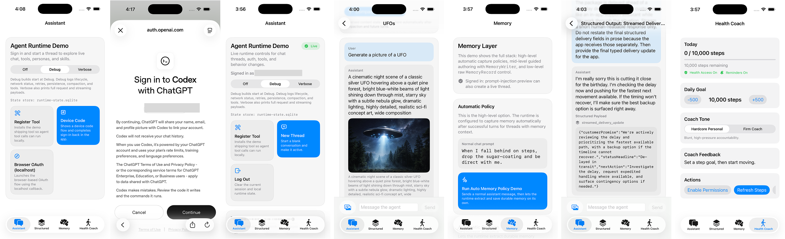

# CodexKit Demo App

This folder contains the checked-in iOS example app for exercising the `CodexKit` embedded agent runtime. The package itself supports both iOS and macOS; this demo remains the iOS sample app.

## Open the app in Xcode

Run:

```sh
open DemoApp/AssistantRuntimeDemoApp.xcodeproj
```

The Xcode project is the source of truth for the demo app. Edit it directly in Xcode and commit project changes normally.

## App overview



- **Assistant:** chat, authentication, model discovery, usage limits, turn controls, tools, personas, and skills.
- **Structured:** typed shipping drafts, imported-content summaries, and streamed structured output.
- **Memory:** automatic capture, guided writing, raw record management, and retrieval previews.
- **Health Coach:** tools and memory combined with HealthKit context and local notifications.

The shared `AgentRuntimeStore` keeps replies scoped to the selected conversation and upserts committed messages by ID during streaming. Interrupted streams can now fail after visible output instead of automatically replaying it. See the [streaming contract](../docs/messaging.md#streaming-validation-and-backend-completion).

## What the app does

- launches a SwiftUI chat screen
- includes a `Health Coach` tab for step-goal tracking
- signs in with ChatGPT using either device code or browser OAuth
- creates or resumes a thread
- lets you type and send a user request
- lets you attach a photo from the library and send it with or without text
- renders attached user images in the transcript
- streams assistant output into the UI
- discovers account models, with bundled fallback choices including GPT-6 Astra, and uses model-specific reasoning levels
- displays model catalog source/fetch time and a `Refresh Models` action
- shows account usage allowances, reset times, and credit information when reported
- displays live reasoning summaries, web-search activity, message phases, and concurrent tool activity
- offers `Add to turn` and `Stop` controls while an ordinary chat turn is running
- includes a `Parallel Lookups` quick start with two independent sample tools
- demonstrates live Combine observation of thread, message, summary, context-state, and context-usage updates
- lets you rename the active thread from the thread detail screen using `setTitle(_:for:)`
- includes a thread-level `Context Compaction` card so you can compact effective prompt state without removing visible transcript history
- supports approval prompts for host-defined tools that opt into `requiresApproval`
- demonstrates thread-pinned personas and one-turn persona overrides
- includes first-class framework skill examples for `health_coach` and `travel_planner`
- demonstrates skill execution policy with skill-specific tool constraints
- includes a one-tap `Run Skill Policy Probe` action that runs the same tool-focused prompt in normal vs skill threads
- includes a `Send Ephemeral Turn` action that runs a transient request without replaying or writing thread history
- showcases runtime APIs that can load persona/skill definitions from local or remote files
- includes a `Show Resolved Instructions` debug toggle so you can inspect per-turn compiled instructions
- includes an `Off` / `Debug` / `Verbose` developer logging control; `Debug` shows SDK lifecycle, request, response, retry, persistence, compaction, and tool activity, while `Verbose` also prints every raw streaming payload
- enables Responses web search in the checked-in demo configuration
- enables hosted Responses image generation in the checked-in demo configuration, with a `Generate Image` quick start
- reads HealthKit step totals (with permission), tracks a daily goal, and schedules local reminder notifications
- supports switchable coaching tone (`Hardcore Personal` or `Firm Coach`)
- proactively generates AI coach feedback in a dedicated persona-pinned thread as steps, goal, or tone change

The checked-in demo registers skill-specific tools (`health_coach_fetch_progress` and `travel_planner_build_day_plan`) plus independent sample lookups (`demo_lookup_weather` and `demo_lookup_transport`), and the Xcode console logs when each tool is requested, executed, and completed so you can verify tool usage during a run.

The demo supports text, photo input, and hosted image generation flows. Generated images render inline in the transcript from `AgentMessage.images`; the revised prompt, size, quality, format, and status come from `AgentImageAttachment.generationMetadata`.

Generated image bytes are persisted the same way as other runtime image attachments: the image data is written to flat files, while the selected runtime store keeps the relative attachment pointer and metadata.

The demo uses the new configuration-first surface:

- `AgentRuntime.Configuration`
- `ChatGPTAuthProvider`
- `KeychainSessionSecureStore`
- `CodexResponsesBackend`
- `SQLiteRuntimeStateStore`
- `RealmRuntimeStateStore`
- `ApprovalInbox` and `DeviceCodePromptCoordinator` from `CodexKitUI`

The app links `CodexKit`, `CodexKitSQLite`, `CodexKitRealm`, and `CodexKitUI` from the repo's local `Package.swift`, so it exercises the same adapter-based SPM integration path a host app would use. The Assistant screen has a SQLite/Realm picker that switches both runtime-state and memory persistence, and every thread row and thread detail screen identifies which adapter powers it. SQLite uses `runtime-state.sqlite` and `memory.sqlite`; Realm uses `runtime-state.realm` and `memory.realm`. The choice persists across launches and is also honored by the demo's App Intents. Each adapter keeps independent data, and either runtime store can import an older sibling `runtime-state.json` file automatically on first launch if one exists.

Both persistent adapters use lazy thread activation. On launch, the demo queries lightweight persisted thread metadata for the thread list without decoding full histories. Selecting a stored thread resumes and hydrates only that thread. Persisted thread rows remain visible when signed out, but must be signed in before they can be resumed.

On iOS, the interactive demo installs `IOSBackgroundActivityProvider`. Active turns request the system's finite background completion window and are cancelled cleanly if that allowance expires. This helps a nearly finished response survive a brief screen lock or app switch; it does not provide durable execution after suspension or process termination.

The demo also inherits the runtime's five-minute turn duration and 128-tool-call limit. The duration includes approval waits; reaching a budget shows a turn failure and clears pending approval. Hosts can adjust these defaults through `AgentRuntime.Configuration.turnLimits`; see [execution limits](../docs/messaging.md#event-buffering-and-execution-limits).

Run `python3 Scripts/verify_ios_simulator.py` from the repository root for the same signed simulator verification used by CI. It creates and removes a temporary simulator, verifies SQLite/Realm completion, reopening, and cancellation, and saves reports in `.build/verification`. For a manually launched Debug app, add `--verify-runtime`; also add `--verify-local-only` to skip live-session lookup. Verification launches bypass ordinary demo setup. See [verification instructions](../docs/verification.md) for scope, session requirements, and report retrieval.

Keep signing enabled when running this check on a simulator: the unsigned CI build can compile successfully while Keychain access fails. The verification guide includes a local ad-hoc signing command.

The checked-in demo enables context compaction in automatic mode. In a thread detail screen, the `Context Compaction` card shows:

- visible transcript token usage
- effective prompt token usage
- estimated context window fullness when available
- compaction generation
- last compaction reason/time
- a `Compact Context Now` action for manual testing

The same thread detail screen also includes an `Observation Demo` card. It subscribes to:

- `observeThread(id:)`
- `observeMessages(in:)`
- `observeThreadSummary(id:)`
- `observeThreadContextState(id:)`
- `observeThreadContextUsage(id:)`

Use that card to verify that:

- local title changes propagate immediately through `setTitle(_:for:)`
- new messages appear from the observation stream without a manual refresh
- context compaction updates the observed context state live
- effective prompt usage updates live in estimated tokens

## Try the runtime features

1. Sign in, then find **Thread Model And Reasoning** on the Assistant screen. Model metadata loads automatically after session restoration or sign-in. Use **Refresh Models** to request fresh account metadata; the source and last successful fetch time appear beside it. A failed explicit refresh shows an error and retains the displayed choices.
2. Select **GPT-6 Astra** if the account catalog includes it, then choose a supported thinking level. Before discovery, the bundled fallback also includes Astra. Selecting a bundled identifier does not grant account access. The selected model applies to future turns in the active thread and to new threads; the demo's initial default remains GPT-5.6 Sol.
3. Under **Quick Starts**, tap **Parallel Lookups**, then **Open Current Thread**. The demo asks for two independent lookups in the same batch. The activity card lists running tools and retains the peak overlap after completion. Both tools opt into parallel execution and pause briefly to make overlap visible. Weather and transport results are fixed sample data. The model can still choose separate calls; a peak-overlap label appears only when overlap actually occurred.
4. During a reply, enter more text or attach an image and tap **Add to turn**. The activity card confirms acceptance. Added input is consumed on the next model request within that turn, potentially adding a further request after the current response; it cannot change a response already being generated. Rejected input stays in the composer. Ordinary sends on that thread are unavailable while it is running.
5. Tap **Stop** to interrupt the current turn. A pending tool-approval sheet also offers **Stop** for these chat turns. The activity card shows **Turn stopped**, pending approvals are dismissed, and the thread can accept a fresh message. Already completed tool actions remain completed.
6. Expand **Reasoning summary** when one arrives, or watch web-search status during a search request. The interactive demo requests summaries, but their availability and message phases depend on the provider. Committed commentary is labeled **Assistant · Progress** and a marked final response **Assistant · Answer**. Activity summaries are transient UI state; committed message phases survive restoration.
7. Return to **Account Usage** to inspect the latest reported allowances and reset times. Values arrive from model-discovery response headers or streamed account-limit updates. Missing limits display an unavailable message rather than zero remaining. These values are separate from conversation token usage; this card does not poll a quota endpoint.

The controls and activity card above cover ordinary chat and the Parallel Lookups quick start. The specialized structured-output, ephemeral, and Health Coach examples retain their own result displays. Runtime replacement and sign-out clear the account catalog, usage snapshots, and transient activity state.

Implementation examples live in `AgentDemoViewModel+RuntimeFeatures.swift`, `RuntimeFeatureViews.swift`, and `AgentDemoViewModel+Messaging.swift`. For API signatures, completion/retry behavior, concurrency barriers, and migration notes, see [Runtime progress, tools, and turn control](../docs/upstream-runtime-features.md).

## Files

- `DemoApp/AssistantRuntimeDemoApp/AssistantRuntimeDemoApp.swift`
- `DemoApp/AssistantRuntimeDemoApp/Info.plist`
- `DemoApp/AssistantRuntimeDemoApp.xcodeproj`
- `DemoApp/AssistantRuntimeDemoApp/Shared/AgentDemoView.swift`
- `DemoApp/AssistantRuntimeDemoApp/Shared/AgentDemoViewModel.swift`
- `DemoApp/AssistantRuntimeDemoApp/Shared/AgentDemoRuntimeFactory.swift`
- `DemoApp/AssistantRuntimeDemoApp/Shared/AgentDemoViewModel+RuntimeFeatures.swift`
- `DemoApp/AssistantRuntimeDemoApp/Shared/RuntimeFeatureViews.swift`
- `Sources/CodexKitUI/AgentRuntimeStore.swift`
- `Sources/CodexKitUI/ApprovalInbox.swift`
- `Sources/CodexKitUI/DeviceCodePromptCoordinator.swift`
