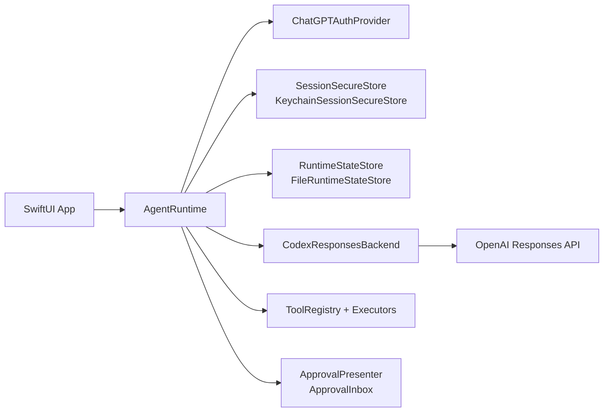

# CodexKit

[](https://github.com/timazed/CodexKit/actions/workflows/ci.yml)


`CodexKit` is a lightweight iOS-first SDK for embedding OpenAI Codex-style agents in Apple apps.

## Who This Is For

Use `CodexKit` if you are building a SwiftUI/iOS app and want:

- ChatGPT sign-in (device code or OAuth)
- secure session persistence
- resumable threaded conversations
- structured local memory with optional prompt injection
- streamed assistant output
- host-defined tools with approval gates
- persona-aware agent behavior

The SDK stays tool-agnostic. Your app defines the tool surface and runtime UX.

## Quickstart (5 Minutes)

1. Add this package to your Xcode project.
2. Build an `AgentRuntime` with auth, secure storage, backend, approvals, and state store.
3. Sign in, create a thread, and send a message.

```swift
import CodexKit
import CodexKitUI

let approvalInbox = ApprovalInbox()
let deviceCodeCoordinator = DeviceCodePromptCoordinator()

let runtime = try AgentRuntime(configuration: .init(
    authProvider: try ChatGPTAuthProvider(
        method: .deviceCode,
        deviceCodePresenter: deviceCodeCoordinator
    ),
    secureStore: KeychainSessionSecureStore(
        service: "CodexKit.ChatGPTSession",
        account: "main"
    ),
    backend: CodexResponsesBackend(
        configuration: .init(
            model: "gpt-5.4",
            reasoningEffort: .medium,
            enableWebSearch: true
        )
    ),
    approvalPresenter: approvalInbox,
    stateStore: FileRuntimeStateStore(
        url: FileManager.default.urls(
            for: .applicationSupportDirectory,
            in: .userDomainMask
        ).first!
        .appendingPathComponent("CodexKit/runtime-state.json")
    )
))

let _ = try await runtime.signIn()
let thread = try await runtime.createThread(title: "First Chat")
let stream = try await runtime.sendMessage(
    UserMessageRequest(text: "Hello from iOS."),
    in: thread.id
)
```

## Feature Matrix

| Capability | Support |
| --- | --- |
| iOS auth: device code | Yes |
| iOS auth: browser OAuth (localhost callback) | Yes |
| Threaded runtime state + restore | Yes |
| Streamed assistant output | Yes |
| Host-defined tools + approval flow | Yes |
| Configurable thinking level | Yes |
| Web search toggle (`enableWebSearch`) | Yes |
| Built-in request retry/backoff | Yes (configurable) |
| Structured local memory layer | Yes |
| Text + image input | Yes |
| Assistant image attachment rendering | Yes |
| Video/audio input attachments | Not yet |
| Built-in image generation API surface | Not yet (tool-based approach supported) |

## Package Products

- `CodexKit`: core runtime, auth, backend, tools, approvals
- `CodexKitUI`: optional SwiftUI-facing helpers

## Architecture



## Recommended Live Setup

The recommended production path for iOS is:

- `ChatGPTAuthProvider`
- `KeychainSessionSecureStore`
- `CodexResponsesBackend`
- `FileRuntimeStateStore`
- `ApprovalInbox` and `DeviceCodePromptCoordinator` from `CodexKitUI`

`ChatGPTAuthProvider` supports:

- `.deviceCode` for the most reliable sign-in path
- `.oauth` for browser-based ChatGPT OAuth

For browser OAuth, `CodexKit` uses the Codex-compatible redirect `http://localhost:1455/auth/callback` internally and only runs the loopback listener during active auth.

`CodexResponsesBackend` also includes built-in retry/backoff for transient failures (`429`, `5xx`, and network-transient URL errors like `networkConnectionLost`). You can tune or disable it:

```swift
let backend = CodexResponsesBackend(
    configuration: .init(
        model: "gpt-5.4",
        requestRetryPolicy: .init(
            maxAttempts: 3,
            initialBackoff: 0.5,
            maxBackoff: 4,
            jitterFactor: 0.2
        )
        // or disable:
        // requestRetryPolicy: .disabled
    )
)
```

`CodexResponsesBackendConfiguration` also lets you control the model thinking level:

```swift
let backend = CodexResponsesBackend(
    configuration: .init(
        model: "gpt-5.4",
        reasoningEffort: .high
    )
)
```

Available values:

- `.low`
- `.medium`
- `.high`
- `.extraHigh`

## Image Attachments

`CodexKit` supports:

- user text + image attachments
- image-only messages
- persisted image attachments in runtime state
- assistant image attachments returned by backend content

```swift
let imageData: Data = ...

let stream = try await runtime.sendMessage(
    UserMessageRequest(
        text: "Describe this image",
        images: [.jpeg(imageData)]
    ),
    in: thread.id
)
```

Custom tools can also return image URLs via `ToolResultContent.image(URL)`, and `CodexKit` attempts to hydrate those into assistant image attachments for chat rendering.

## Memory Layer

`CodexKit` includes a generic memory layer for app-authored records. The SDK owns storage, retrieval, ranking, and optional prompt injection. Your app still decides what to remember and when to write it.

```swift
let memoryURL = FileManager.default.urls(
    for: .applicationSupportDirectory,
    in: .userDomainMask
).first!
    .appendingPathComponent("CodexKit/memory.sqlite")

let memoryStore = try SQLiteMemoryStore(url: memoryURL)

try await memoryStore.upsert(
    MemoryRecord(
        namespace: "oval-office",
        scope: "actor:eleanor_price",
        kind: "grievance",
        summary: "Eleanor remembers being overruled on the trade bill.",
        evidence: ["She warned the player twice before being ignored."],
        importance: 0.9,
        tags: ["trade", "advisor"]
    ),
    dedupeKey: "trade-bill-overruled-eleanor"
)

let runtime = try AgentRuntime(configuration: .init(
    authProvider: try ChatGPTAuthProvider(
        method: .deviceCode,
        deviceCodePresenter: deviceCodeCoordinator
    ),
    secureStore: KeychainSessionSecureStore(
        service: "CodexKit.ChatGPTSession",
        account: "main"
    ),
    backend: CodexResponsesBackend(),
    approvalPresenter: approvalInbox,
    stateStore: FileRuntimeStateStore(
        url: FileManager.default.urls(
            for: .applicationSupportDirectory,
            in: .userDomainMask
        ).first!
        .appendingPathComponent("CodexKit/runtime-state.json")
    ),
    memory: .init(store: memoryStore)
))

let thread = try await runtime.createThread(
    title: "Press Chat",
    memoryContext: AgentMemoryContext(
        namespace: "oval-office",
        scopes: ["actor:eleanor_price", "thread:press"]
    )
)
```

Per-turn memory can be narrowed, expanded, replaced, or disabled with `MemorySelection`:

```swift
let stream = try await runtime.sendMessage(
    UserMessageRequest(
        text: "How should Eleanor frame this rebuttal?",
        memorySelection: MemorySelection(
            mode: .append,
            scopes: ["world:public"],
            tags: ["trade"]
        )
    ),
    in: thread.id
)
```

For debugging and tooling, memory stores also support direct inspection:

```swift
let stored = try await memoryStore.record(
    id: "some-memory-id",
    namespace: "oval-office"
)
let records = try await memoryStore.list(
    namespace: "oval-office",
    scopes: ["actor:eleanor_price"],
    includeArchived: true,
    limit: 20
)
let diagnostics = try await memoryStore.diagnostics(namespace: "oval-office")
```

## Pinned And Dynamic Personas

`CodexKit` supports layered persona precedence:

- base runtime instructions
- thread-pinned persona
- turn override

Persona swaps are runtime metadata, not transcript messages, so they do not materially grow the transcript context.

```swift
let supportPersona = AgentPersonaStack(layers: [
    .init(name: "domain", instructions: "You are an expert customer support agent for a shipping app."),
    .init(name: "style", instructions: "Be concise, calm, and action-oriented.")
])

let thread = try await runtime.createThread(
    title: "Support Chat",
    personaStack: supportPersona
)

let reviewerOverride = AgentPersonaStack(layers: [
    .init(name: "reviewer", instructions: "For this reply only, act as a strict reviewer and call out risks first.")
])

let stream = try await runtime.sendMessage(
    UserMessageRequest(
        text: "Review this architecture and point out the risks.",
        personaOverride: reviewerOverride
    ),
    in: thread.id
)
```

## Demo App

The checked-in demo app under `DemoApp/` consumes local package products through SPM.


```sh
open DemoApp/AssistantRuntimeDemoApp.xcodeproj
```

The demo app exercises:

- device-code and browser-based ChatGPT sign-in
- streamed assistant output and resumable threads
- host tools with skill-specific examples for health coaching and travel planning
- image messages from the photo library through the composer
- Responses web search in checked-in configuration
- thread-pinned personas and one-turn overrides
- a one-tap skill policy probe that compares tool behavior in normal vs skill-constrained threads
- a Health Coach tab with HealthKit steps, AI-generated coaching, local reminders, and tone switching

## Skill Examples

`CodexKit` skills are behavior modules, not just tone layers. They can carry both instructions and execution policy (tool allow/require/sequence/call limits).

```swift
let healthCoachSkill = AgentSkill(
    id: "health_coach",
    name: "Health Coach",
    instructions: "You are a health coach focused on daily step goals and execution. For every user turn, call the health_coach_fetch_progress tool exactly once before your final reply.",
    executionPolicy: .init(
        allowedToolNames: ["health_coach_fetch_progress"],
        requiredToolNames: ["health_coach_fetch_progress"],
        maxToolCalls: 1
    )
)

let travelPlannerSkill = AgentSkill(
    id: "travel_planner",
    name: "Travel Planner",
    instructions: "You are a travel planning assistant for mobile users. Provide concise day-by-day itineraries, practical logistics, and a compact packing checklist.",
    executionPolicy: .init(
        allowedToolNames: ["lookup_flights", "lookup_hotels"],
        requiredToolNames: ["lookup_flights"],
        toolSequence: ["lookup_flights", "lookup_hotels"],
        maxToolCalls: 3
    )
)

let runtime = try AgentRuntime(configuration: .init(
    authProvider: authProvider,
    secureStore: secureStore,
    backend: backend,
    approvalPresenter: approvalPresenter,
    stateStore: stateStore,
    skills: [healthCoachSkill, travelPlannerSkill]
))

let healthThread = try await runtime.createThread(
    title: "Skill Demo: Health Coach",
    skillIDs: ["health_coach"]
)

let tripThread = try await runtime.createThread(
    title: "Skill Demo: Travel Planner",
    skillIDs: ["travel_planner"]
)

let stream = try await runtime.sendMessage(
    UserMessageRequest(
        text: "Review this plan with extra travel rigor.",
        skillOverrideIDs: ["travel_planner"]
    ),
    in: healthThread.id
)
```

## Dynamic Persona And Skill Sources

You can load persona/skill instructions from local files or remote URLs at runtime.

```swift
let localPersonaURL = URL(fileURLWithPath: "/path/to/persona.txt")
let thread = try await runtime.createThread(
    title: "Dynamic Persona Thread",
    personaSource: .file(localPersonaURL)
)
```

```swift
let remoteSkillURL = URL(string: "https://example.com/skills/shipping_support.json")!
let skill = try await runtime.registerSkill(
    from: .remote(remoteSkillURL)
)

try await runtime.setSkillIDs([skill.id], for: thread.id)
```

For persona sources:

- plain text creates a single-layer persona stack
- JSON can be a full `AgentPersonaStack`

For skill sources:

- JSON supports `{ "id": "...", "name": "...", "instructions": "...", "executionPolicy": { ... } }`
- plain text is supported when you pass `id` and `name` in `registerSkill(from:id:name:)`

## Debugging Instruction Resolution

You can preview the exact compiled instructions for a specific send before starting a turn.

```swift
let preview = try await runtime.resolvedInstructionsPreview(
    for: thread.id,
    request: UserMessageRequest(
        text: "Give me a strict step plan."
    )
)
print(preview)
```

## Production Checklist

- Store sessions in keychain (`KeychainSessionSecureStore`)
- Use persistent runtime state (`FileRuntimeStateStore`)
- Gate impactful tools with approvals
- Handle auth cancellation and sign-out resets cleanly
- Tune retry/backoff policy for your app’s UX and latency targets
- Log tool invocations and failures for supportability
- Validate HealthKit/notification permission fallback states if using health features

## Troubleshooting

- OAuth sheet closes but app does not update:
  - confirm redirect is `http://localhost:1455/auth/callback`
  - ensure app refreshes snapshot/state after sign-in completion
- Health steps stay at `0`:
  - verify HealthKit permission granted for Steps
  - confirm this is running on a device/profile with step data
- Tool never executes:
  - check approval prompt handling
  - inspect host logs for `toolCallStarted` / `toolCallFinished`

## Versioning And Releases

`CodexKit` uses Semantic Versioning. The latest stable release is `v1.1.0`.

- Release notes live in [CHANGELOG.md](CHANGELOG.md)
- CI runs on pushes/PRs via [`.github/workflows/ci.yml`](.github/workflows/ci.yml)
- Stable releases are cut with annotated tags (`vMAJOR.MINOR.PATCH`)

## Contributing And Security

- Contributing guide: [CONTRIBUTING.md](CONTRIBUTING.md)
- Security policy: [SECURITY.md](SECURITY.md)
