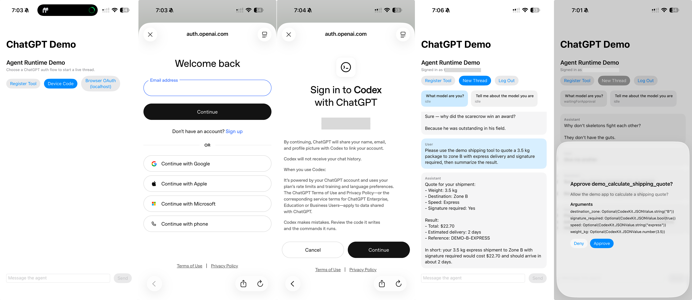

# CodexKit

`CodexKit` is a lightweight embedded agent runtime for Apple platforms.

It gives an app:

- ChatGPT sign-in
- secure session persistence
- resumable agent threads
- streamed output
- host-defined tools
- approval-gated tool execution

The core SDK stays tool-agnostic. Your app defines the actual tools.

## Package Products

- `CodexKit`: core runtime, auth, backend, tools, approvals
- `CodexKitUI`: optional SwiftUI-facing helpers

## Recommended Live Setup

The recommended production path for iOS is:

- `ChatGPTAuthProvider`
- `KeychainSessionSecureStore`
- `CodexResponsesBackend`
- `FileRuntimeStateStore`
- `ApprovalInbox` and `DeviceCodePromptCoordinator` from `CodexKitUI`

`ChatGPTAuthProvider` supports the two iOS-facing auth modes:

- `.deviceCode` for the most reliable sign-in path
- `.oauth` for browser-based ChatGPT OAuth

For browser-based ChatGPT OAuth, use `.oauth`. `CodexKit` uses the Codex-compatible localhost redirect `http://localhost:1455/auth/callback` internally and only starts the loopback listener while interactive auth is in progress.

## Inline Example

```swift
import CodexKit
import CodexKitUI

let approvalInbox = ApprovalInbox()
let deviceCodeCoordinator = DeviceCodePromptCoordinator()

let runtime = try AgentRuntime(configuration: .init(
    authProvider: try ChatGPTAuthProvider(
        method: .deviceCode,
        deviceCodePresenter: deviceCodeCoordinator
    ),
    secureStore: KeychainSessionSecureStore(
        service: "CodexKit.ChatGPTSession",
        account: "main"
    ),
    backend: CodexResponsesBackend(),
    approvalPresenter: approvalInbox,
    stateStore: FileRuntimeStateStore(
        url: FileManager.default.urls(
            for: .applicationSupportDirectory,
            in: .userDomainMask
        ).first!
        .appendingPathComponent("CodexKit/runtime-state.json")
    ),
    tools: [
        .init(
            definition: ToolDefinition(
                name: "get_local_time",
                description: "Return the current local time.",
                inputSchema: .object([
                    "type": .string("object"),
                    "properties": .object([:])
                ]),
                approvalPolicy: .requiresApproval,
                approvalMessage: "Allow the app to read the current local time?"
            ),
            executor: AnyToolExecutor { invocation, _ in
                .success(
                    invocation: invocation,
                    text: Date.now.formatted(date: .omitted, time: .standard)
                )
            }
        )
    ]
))
```

To give the model built-in web search, enable it on the backend configuration:

```swift
let backend = CodexResponsesBackend(
    configuration: CodexResponsesBackendConfiguration(
        model: "gpt-5.4",
        enableWebSearch: true
    )
)
```

`CodexKit` currently supports text and image input flows in this runtime. Built-in image generation is not part of the SDK surface.

## Image Attachments

`CodexKit` now supports:

- user message text plus image attachments
- image-only messages
- persisted image attachments in runtime state
- assistant image attachments when the backend returns image content

This first pass does not yet add video or audio attachment support.

```swift
let imageData: Data = ...

let stream = try await runtime.sendMessage(
    UserMessageRequest(
        text: "Describe this image",
        images: [
            .jpeg(imageData)
        ]
    ),
    in: thread.id
)
```

Image attachments are sent to the backend as image inputs, so the host app can bridge picked photos into the assistant without introducing a separate upload API first.

Custom tools can also return image URLs via `ToolResultContent.image(URL)`. `CodexKit` forwards those URLs back to the model in the function output and attempts to hydrate them into assistant image attachments so they can render in chat.

Hydration supports `data:` URLs, `file:` URLs, and network image URLs (`http`/`https`). If a URL cannot be read as an image, the turn still succeeds and the tool text output is preserved.

```swift
let generateDiagramTool = AgentRuntime.ToolRegistration(
    definition: ToolDefinition(
        name: "generate_diagram_image",
        description: "Generate a diagram image and return a URL.",
        inputSchema: .object([
            "type": .string("object"),
            "properties": .object([
                "prompt": .object(["type": .string("string")]),
            ]),
        ]),
        approvalPolicy: .requiresApproval
    ),
    executor: AnyToolExecutor { invocation, _ in
        let imageURL = URL(string: "https://example.com/generated-diagram.png")!
        return ToolResultEnvelope(
            invocationID: invocation.id,
            toolName: invocation.toolName,
            success: true,
            content: [
                .text("Generated diagram image."),
                .image(imageURL),
            ]
        )
    }
)
```

## Pinned And Dynamic Personas

`CodexKit` supports layered personas with this precedence order:

- base runtime instructions
- thread-pinned persona
- turn override

Persona swaps are runtime metadata, not transcript messages, so they do not stack up in the conversation history or materially grow the context window.

Start with shared base instructions on the backend:

```swift
let backend = CodexResponsesBackend(
    configuration: CodexResponsesBackendConfiguration(
        model: "gpt-5.4",
        instructions: """
        You are a helpful assistant embedded in an iOS app.
        Do not assume shell, terminal, repository, or desktop capabilities unless the host exposes them.
        """
    )
)

let runtime = try AgentRuntime(configuration: .init(
    authProvider: authProvider,
    secureStore: secureStore,
    backend: backend,
    approvalPresenter: approvalPresenter,
    stateStore: stateStore
))
```

If you want the runtime to override or supply base instructions independently of the backend, set `baseInstructions` on `AgentRuntime.Configuration`:

```swift
let runtime = try AgentRuntime(configuration: .init(
    authProvider: authProvider,
    secureStore: secureStore,
    backend: backend,
    approvalPresenter: approvalPresenter,
    stateStore: stateStore,
    baseInstructions: """
    You are a warm in-app assistant.
    Keep answers concise and avoid assuming tools the host has not registered.
    """
))
```

Pin a persona stack to a thread:

```swift
let supportPersona = AgentPersonaStack(layers: [
    .init(
        name: "domain",
        instructions: "You are an expert customer support agent for a shipping app."
    ),
    .init(
        name: "style",
        instructions: "Be concise, calm, and action-oriented."
    )
])

let thread = try await runtime.createThread(
    title: "Support Chat",
    personaStack: supportPersona
)
```

Hot-swap the pinned persona for future turns in that thread:

```swift
let plannerPersona = AgentPersonaStack(layers: [
    .init(
        name: "planner",
        instructions: "Act as a careful technical planner. Focus on tradeoffs and implementation sequencing."
    )
])

try await runtime.setPersonaStack(plannerPersona, for: thread.id)
```

Use a one-off override for a single turn:

```swift
let reviewerOverride = AgentPersonaStack(layers: [
    .init(
        name: "reviewer",
        instructions: "For this reply only, act as a strict reviewer and call out risks first."
    )
])

let stream = try await runtime.sendMessage(
    UserMessageRequest(
        text: "Review this architecture and point out the risks.",
        personaOverride: reviewerOverride
    ),
    in: thread.id
)
```

## Demo App

The checked-in demo app lives under `DemoApp/` and consumes the local Swift package products through SPM.



To open the demo app:

```sh
open DemoApp/AssistantRuntimeDemoApp.xcodeproj
```

The demo app exercises:

- device-code and browser-based ChatGPT sign-in
- streamed assistant output and resumable threads
- approval-gated host tools with a shipping quote example
- image messages from the photo library through the composer
- Responses web search in the checked-in configuration
- thread-pinned personas plus one-turn persona overrides
- a dedicated Health Coach tab with HealthKit step tracking, AI-generated coach feedback, local reminders, and switchable coaching tone (Hardcore Personal or Firm Coach)
