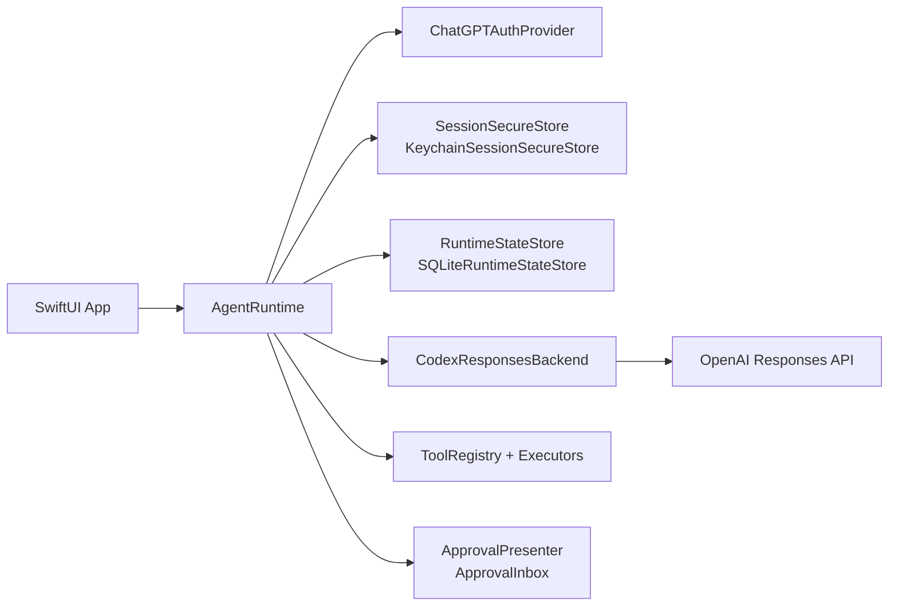
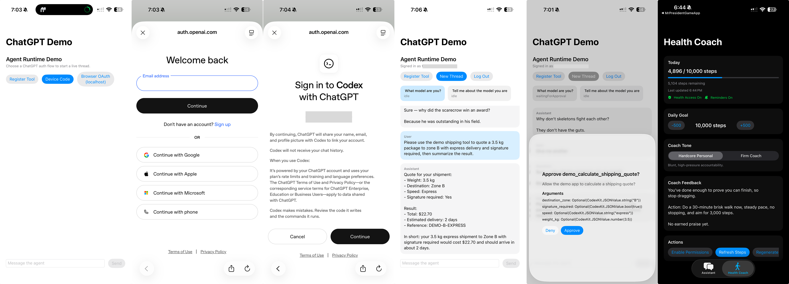

# CodexKit

[](https://github.com/timazed/CodexKit/actions/workflows/ci.yml)


`CodexKit` is a lightweight SDK for embedding OpenAI Codex-style agents in Apple apps, with explicit support for iOS and macOS.

`main` documents the upcoming `2.0` development line. If you are integrating the latest stable release, use the [`v1.1.0` docs](https://github.com/timazed/CodexKit/blob/v1.1.0/README.md) instead.

## Who This Is For

Use `CodexKit` if you are building a SwiftUI app for iOS or macOS and want:

- ChatGPT sign-in (device code or OAuth)
- secure session persistence
- resumable threaded conversations
- structured local memory with optional prompt injection
- streamed assistant output
- typed request context alongside freeform prompt text
- declarative request fulfillment policy via typed options
- typed one-shot text and structured completions
- host-defined tools with approval gates
- persona- and skill-aware agent behavior
- hidden runtime context compaction with preserved user-visible history
- opt-in developer logging across runtime, auth, backend, and bundled stores
- share/import-friendly message construction

The SDK stays tool-agnostic. Your app defines the tool surface and runtime UX.

## Core Concepts

- `AgentRuntime`
  The main entry point. Owns auth state, threads, tool execution, personas, skills, and optional memory.
- `AgentThread`
  A persistent conversation with its own status, title, persona stack, skill IDs, and optional memory context.
- `Request`
  A single turn request. Can include text, images, imported content, optional app-provided context, optional fulfillment-policy options, persona override, skill override, and memory selection.
- `RequestContext`
  Optional authoritative machine context supplied by the host app for a turn.
- `RequestOptionsRepresentable`
  A typed, app-owned way to describe fulfillment policy for a turn through a mode plus natural-language requirements.
- `CodexResponsesBackend`
  The built-in ChatGPT/Codex-style backend used for text/image/tool turns.
- `ToolDefinition`
  A host-defined capability the model can call through your app.
- `AgentPersonaStack`
  Layered behavior instructions pinned to a thread or applied for one turn.
- `AgentSkill`
  A behavior module that can carry instructions plus tool policy.
- `AgentStructuredOutput`
  A typed `Decodable` contract for schema-constrained replies.
- `AgentMemoryConfiguration`
  Optional local memory storage, retrieval, ranking, and capture policy.

## Choose Your Level

- Simple chat
  Sign in, create a thread, and call `stream(...)` or `send(...)`.
- Typed app flows
  Use `send(..., response:)` to get a `Decodable` value back.
- Guided retrieval/enrichment
  Use `Request.options` to tell the model how to fulfill the turn so the typed response contract can be satisfied.
- Tool-driven agents
  Register host tools and optionally gate them with approvals.
- Rich behavior
  Add thread personas, skills, and execution policies.
- Memory-backed agents
  Opt into automatic memory capture, guided writing, or raw record management.

## Quickstart (5 Minutes)

This quickstart targets the current `main` branch API surface (`2.0` development line).

1. Add this package to your Xcode project.
2. Build an `AgentRuntime` with auth, secure storage, backend, approvals, and state store.
3. Sign in, create a thread, and send a message.

```swift
import CodexKit
import CodexKitUI

let approvalInbox = ApprovalInbox()
let deviceCodeCoordinator = DeviceCodePromptCoordinator()

let runtime = try AgentRuntime(configuration: .init(
    authProvider: try ChatGPTAuthProvider(
        method: .deviceCode,
        deviceCodePresenter: deviceCodeCoordinator
    ),
    secureStore: KeychainSessionSecureStore(
        service: "CodexKit.ChatGPTSession",
        account: "main"
    ),
    backend: CodexResponsesBackend(
        configuration: .init(
            model: "gpt-5.4",
            reasoningEffort: .medium,
            enableWebSearch: true
        )
    ),
    approvalPresenter: approvalInbox,
    stateStore: try SQLiteRuntimeStateStore(
        url: FileManager.default.urls(
            for: .applicationSupportDirectory,
            in: .userDomainMask
        ).first!
        .appendingPathComponent("CodexKit/runtime-state.sqlite")
    )
))

let _ = try await runtime.signIn()
let thread = try await runtime.createThread(title: "First Chat")
let stream = try await runtime.stream(
    Request(text: "Hello from Apple platforms."),
    in: thread.id
)
```

## 2.0 Migration Notes

If you are moving code forward from earlier 2.0 alpha snapshots, there are two important API changes to update:

- `GRDBRuntimeStateStore` was renamed to `SQLiteRuntimeStateStore`
  The public runtime-store surface now uses `SQLite` naming consistently alongside `SQLiteMemoryStore`.
- request context is now first-class
  Use `Request` with `context:` when you want to attach host-app context separately from freeform prompt text.
- fulfillment policy is request-side
  Use `Request.options` when the app needs to guide how lookup or enrichment work should be performed without putting that policy into user-visible text.

Example rename:

```swift
// Before
let stateStore = try GRDBRuntimeStateStore(url: stateURL)

// Now
let stateStore = try SQLiteRuntimeStateStore(url: stateURL)
```

## Feature Matrix

| Capability | Support |
| --- | --- |
| Supported platforms | iOS 17+, macOS 14+ |
| iOS auth: device code | Yes |
| iOS auth: browser OAuth (localhost callback) | Yes |
| Threaded runtime state + restore | Yes |
| Streamed assistant output | Yes |
| Host-defined tools + approval flow | Yes |
| Configurable thinking level | Yes |
| Web search toggle (`enableWebSearch`) | Yes |
| Built-in request retry/backoff | Yes (configurable) |
| Structured local memory layer | Yes |
| Text + image input | Yes |
| Typed request context | Yes |
| Declarative request fulfillment policy | Yes |
| Typed structured output (`Decodable`) | Yes |
| Mixed streamed text + typed structured output | Yes |
| Share/import helper (`AgentImportedContent`) | Yes |
| App Intents / Shortcuts example | Yes |
| Assistant image attachment rendering | Yes |
| Video/audio input attachments | Not yet |
| Built-in image generation API surface | Not yet (tool-based approach supported) |

## Package Products

- `CodexKit`: core runtime, auth, backend, tools, approvals
- `CodexKitUI`: optional SwiftUI-facing helpers

Supported package platforms:

- iOS 17+
- macOS 14+

## Architecture



## Recommended Live Setup

The recommended production path for iOS and macOS is:

- `ChatGPTAuthProvider`
- `KeychainSessionSecureStore`
- `CodexResponsesBackend`
- `SQLiteRuntimeStateStore`
- `ApprovalInbox` and `DeviceCodePromptCoordinator` from `CodexKitUI`

Bundled runtime-state stores now include:

- `SQLiteRuntimeStateStore`
  The recommended production store. Uses SQLite through GRDB, supports migrations, query pushdown, redaction, whole-thread deletion, paged history reads, and lightweight restore/inspection.
- `FileRuntimeStateStore`
  A simple JSON-backed fallback for small apps, tests, or export/import-style workflows.
- `InMemoryRuntimeStateStore`
  Useful for previews and tests.

The bundled memory store is:

- `SQLiteMemoryStore`
  Uses SQLite through GRDB for persisted memory records. Ordinary record reads/writes use GRDB requests directly; the remaining raw SQL is limited to SQLite-specific `PRAGMA` and FTS `MATCH` / `bm25()` paths.

If you are migrating from the older file-backed store, `SQLiteRuntimeStateStore(url:)` automatically imports a sibling `*.json` runtime state file on first open. For example, `runtime-state.sqlite` will import from `runtime-state.json` if it exists and the SQLite store is still empty.

`ChatGPTAuthProvider` supports:

- `.deviceCode` for the most reliable sign-in path
- `.oauth` for browser-based ChatGPT OAuth

For browser OAuth, `CodexKit` uses the Codex-compatible redirect `http://localhost:1455/auth/callback` internally and only runs the loopback listener during active auth.

## Platform Boundary

`CodexKit` ships a ChatGPT/Codex-style account flow and backend. It does not provide general OpenAI API platform access.

That means:

- built in: ChatGPT sign-in, Codex-style threaded turns, tools, personas, skills, structured output, and optional local memory
- not built in: separate API-key-based OpenAI platform clients, Realtime voice sessions, or other non-Codex API access

If your app needs capabilities outside the built-in backend path, the intended approach is to expose them through your own host tools or custom backend integration.

`CodexResponsesBackend` also includes built-in retry/backoff for transient failures (`429`, `5xx`, and network-transient URL errors like `networkConnectionLost`). You can tune or disable it:

```swift
let backend = CodexResponsesBackend(
    configuration: .init(
        model: "gpt-5.4",
        requestRetryPolicy: .init(
            maxAttempts: 3,
            initialBackoff: 0.5,
            maxBackoff: 4,
            jitterFactor: 0.2
        )
        // or disable:
        // requestRetryPolicy: .disabled
    )
)
```

`CodexResponsesBackendConfiguration` also lets you control the model thinking level:

```swift
let backend = CodexResponsesBackend(
    configuration: .init(
        model: "gpt-5.4",
        reasoningEffort: .high
    )
)
```

## Developer Logging

`CodexKit` includes opt-in developer logging for the SDK itself. Logging is disabled by default and can be enabled independently on the runtime, built-in backend, and bundled stores.

```swift
let logging = AgentLoggingConfiguration.console(
    minimumLevel: .debug
)

let backend = CodexResponsesBackend(
    configuration: .init(
        model: "gpt-5.4",
        logging: logging
    )
)

let stateStore = try SQLiteRuntimeStateStore(
    url: stateURL,
    logging: logging
)

let runtime = try AgentRuntime(configuration: .init(
    authProvider: authProvider,
    secureStore: secureStore,
    backend: backend,
    approvalPresenter: approvalInbox,
    stateStore: stateStore,
    logging: logging
))
```

You can also filter by category:

```swift
let logging = AgentLoggingConfiguration.osLog(
    minimumLevel: .debug,
    categories: [.runtime, .persistence, .network, .tools],
    subsystem: "com.example.myapp"
)
```

Available logging categories include:

- `auth`
- `runtime`
- `persistence`
- `network`
- `retry`
- `compaction`
- `tools`
- `approvals`
- `structuredOutput`
- `memory`

When `network` logging is enabled at `.debug`, `CodexKit` also emits raw request and response payloads for the built-in Codex backend:

- outbound `/responses` request JSON bodies
- inbound streaming SSE event payloads
- outbound `/responses/compact` request JSON bodies
- inbound `/responses/compact` response JSON bodies

That is intentionally verbose and may include prompt text, request context, tool arguments, and model output, so it should be treated as a developer-only debugging mode.

Use `AgentConsoleLogSink` for stderr-style console logs, `AgentOSLogSink` for unified Apple logging, or provide your own `AgentLogSink`.

Custom sinks make it possible to bridge `CodexKit` logs into your own telemetry or logging pipeline:

```swift
struct RemoteTelemetrySink: AgentLogSink {
    func log(_ entry: AgentLogEntry) {
        Telemetry.shared.enqueue(
            level: entry.level,
            category: entry.category.rawValue,
            message: entry.message,
            metadata: entry.metadata,
            timestamp: entry.timestamp
        )
    }
}

let logging = AgentLoggingConfiguration(
    minimumLevel: .info,
    sink: RemoteTelemetrySink()
)
```

`AgentLogEntry` includes:

- timestamp
- level
- category
- message
- metadata

For remote telemetry or file-backed logging, prefer a sink that buffers or enqueues work quickly. `AgentLogSink.log(_:)` is called inline, so it should avoid blocking network I/O on the caller's execution path.

## Persistent State And Queries

`CodexKit` now treats runtime persistence as a queryable store instead of a single “load the whole thread” blob. For most apps, the main thing to know is:

- use `SQLiteRuntimeStateStore` for persisted production state
- use `fetchThreadHistory(id:query:)` and `fetchLatestStructuredOutputMetadata(id:)` for common thread inspection
- use the typed `execute(_:)` query surface when you need more control over filtering, sorting, paging, or cross-thread reads
- use hidden context compaction when you want to optimize future turns without removing preserved thread history from UI or inspection APIs

```swift
let stateStore = try SQLiteRuntimeStateStore(
    url: FileManager.default.urls(
        for: .applicationSupportDirectory,
        in: .userDomainMask
    ).first!
    .appendingPathComponent("CodexKit/runtime-state.sqlite")
)

let runtime = try AgentRuntime(configuration: .init(
    authProvider: authProvider,
    secureStore: secureStore,
    backend: backend,
    approvalPresenter: approvalPresenter,
    stateStore: stateStore
))

let page = try await runtime.fetchThreadHistory(
    id: thread.id,
    query: .init(limit: 40, direction: .backward)
)

let snapshots = try await runtime.execute(
    ThreadSnapshotQuery(limit: 20)
)
```

This path also supports explicit history redaction and whole-thread deletion without forcing hosts to replay raw event streams themselves.

## Live Observation

`CodexKit` exposes Combine publishers so apps can react to runtime state changes without polling or manual callback wiring.

```swift
import Combine

var cancellables = Set<AnyCancellable>()

runtime.observeThread(id: thread.id)
    .receive(on: DispatchQueue.main)
    .sink { thread in
        print("Observed title:", thread?.title ?? "Untitled")
    }
    .store(in: &cancellables)

runtime.observeMessages(in: thread.id)
    .receive(on: DispatchQueue.main)
    .sink { messages in
        print("Observed message count:", messages.count)
    }
    .store(in: &cancellables)

runtime.observeThreadContextState(id: thread.id)
    .receive(on: DispatchQueue.main)
    .sink { contextState in
        print("Observed compaction generation:", contextState?.generation ?? 0)
    }
    .store(in: &cancellables)

runtime.observeThreadContextUsage(id: thread.id)
    .receive(on: DispatchQueue.main)
    .sink { usage in
        print("Estimated effective tokens:", usage?.effectiveEstimatedTokenCount ?? 0)
    }
    .store(in: &cancellables)

try await runtime.setTitle("Shipping Triage", for: thread.id)
```

Available built-in publishers:

- `observeThreads()`
- `observeThread(id:)`
- `observeMessages(in:)`
- `observeThreadSummary(id:)`
- `observeThreadContextState(id:)`
- `observeThreadContextUsage(id:)`

The checked-in demo app includes a thread detail `Observation Demo` card that exercises these publishers live, along with a rename control that calls `setTitle(_:for:)`.

## Effective Context Compaction

`CodexKit` can compact the runtime's effective prompt context without mutating canonical thread history.

- visible history stays intact for `messages(for:)`, `fetchThreadHistory(...)`, and normal thread UI
- compacted effective context is used only for future turns
- compaction markers are persisted for audit/debug semantics and hidden from normal history reads by default
- manual compaction is always available when the feature is enabled; `.automatic` additionally lets the runtime compact pre-turn or after a context-limit retry path

```swift
let runtime = try AgentRuntime(configuration: .init(
    authProvider: authProvider,
    secureStore: secureStore,
    backend: backend,
    approvalPresenter: approvalPresenter,
    stateStore: stateStore,
    contextCompaction: .init(
        isEnabled: true,
        mode: .automatic
    )
))

let contextState = try await runtime.compactThreadContext(id: thread.id)
print(contextState.generation)

let usage = try await runtime.fetchThreadContextUsage(id: thread.id)
print(usage?.effectiveEstimatedTokenCount ?? 0)
```

For debug tooling or host inspection, you can also read the compacted effective context and the current estimated context-window usage directly:

```swift
let contextState = try await runtime.fetchThreadContextState(id: thread.id)
let usage = try await runtime.fetchThreadContextUsage(id: thread.id)
let contexts = try await runtime.execute(
    ThreadContextStateQuery(threadIDs: [thread.id])
)
```

## Typed Completions

For most apps, there are now three common send paths:

- `stream(...)`
  Stream deltas, tool events, approvals, and final turn completion.
- `stream(..., response:)`
  Stream normal turn events plus typed structured-output events in the same turn.
- `send(...)`
  Return the assistant's final text as a `String`.
- `send(..., response:)`
  Return a typed `Decodable` value from a structured response.

If you need to send host-app context or fulfillment policy separately from human prompt text, use `Request` with `context` and `options`. CodexKit keeps both in developer-message space so the model can see them without pretending they are user-authored text.

- `context`
  Optional authoritative machine context for the turn.
- `options`
  Optional fulfillment policy for the turn. Use this to describe how lookup, retrieval, or enrichment work should be performed.
- `response:`
  The typed response contract CodexKit transmits, validates, and decodes.

```swift
struct PlannerContext: Codable, Sendable {
    let objective: String
    let customerTier: String
}

let draft = try await runtime.send(
    try Request(
        text: "Draft a response for the delayed package.",
        context: PlannerContext(
            objective: "Resolve the shipping complaint quickly.",
            customerTier: "plus"
        ),
        contextSchemaName: "PlannerContext"
    ),
    in: thread.id,
    response: ShippingReplyDraft.self
)
```

For retrieval-style workflows, `options` can carry app-owned declarative requirements that render into fulfillment instructions:

```swift
protocol NaturalLanguageRenderable {
    var naturalLanguage: String { get }
}

protocol RequestMode: NaturalLanguageRenderable, Sendable { }
protocol RequestRequirement: NaturalLanguageRenderable, Sendable { }

struct KnownVenue: Codable, Sendable {
    let id: String
}

enum ResearchMode: RequestMode {
    case enrichment

    var naturalLanguage: String {
        "Enrich the known result with additional grounded details."
    }
}

enum VenueRequirement: RequestRequirement {
    case rating
    case availability

    var naturalLanguage: String {
        switch self {
        case .rating:
            "Find the venue rating and review count using Google."
        case .availability:
            "Find availability information using OpenTable."
        }
    }
}

struct VenueLookupOptions: RequestOptionsRepresentable {
    let mode: ResearchMode
    let requirements: [VenueRequirement]
}

let venue = try await runtime.send(
    Request(
        text: "Mr Wong's",
        context: try RequestContext(KnownVenue(id: "venue_123")),
        options: VenueLookupOptions(
            mode: .enrichment,
            requirements: [.rating, .availability]
        )
    ),
    in: thread.id,
    response: ShippingReplyDraft.self
)
```

That request is sent conceptually as:

```text
Developer message: request context
- known venue id: venue_123

Developer message: request options
Mode:
- Enrich the known result with additional grounded details.
Requirements:
- Find the venue rating and review count using Google.
- Find availability information using OpenTable.

User message
Mr Wong's

Response contract
Return the final result serialized as the declared response schema.
```

For App Intents, share flows, widgets, or other non-chat surfaces, `CodexKit` can return a typed value directly from `send`:

```swift
let summary = try await runtime.send(
    Request(text: "Summarize the latest thread activity."),
    in: thread.id
)
```

Structured output is schema-driven and decoded into your `Decodable` type:

```swift
struct ShippingReplyDraft: AgentStructuredOutput {
    let subject: String
    let reply: String
    let urgency: String

    static let responseFormat = AgentStructuredOutputFormat(
        name: "shipping_reply_draft",
        description: "A concise shipping support reply draft.",
        schema: .object(
            properties: [
                "subject": .string(),
                "reply": .string(),
                "urgency": .string(enum: ["low", "medium", "high"]),
            ],
            required: ["subject", "reply", "urgency"],
            additionalProperties: false
        )
    )
}

let draft = try await runtime.send(
    Request(text: "Draft a response for the delayed package."),
    in: thread.id,
    response: ShippingReplyDraft.self
)
```

If you want streamed prose and typed machine output in the same turn, use the streaming overload:

```swift
let stream = try await runtime.stream(
    Request(text: "Draft a response for the delayed package."),
    in: thread.id,
    response: ShippingReplyDraft.self,
    options: .init(required: true)
)

for try await event in stream {
    switch event {
    case let .assistantMessageDelta(_, _, delta):
        print("visible:", delta)
    case let .structuredOutputPartial(snapshot):
        print("partial:", snapshot)
    case let .structuredOutputCommitted(snapshot):
        print("final:", snapshot)
    default:
        break
    }
}
```

The structured payload is delivered out-of-band from assistant prose. CodexKit keeps request-time structured metadata separate from runtime instructions, strips its internal framing before emitting text deltas or committed assistant messages, and persists the final committed payload metadata with the assistant message for later restore/inspection.

`CodexKit` sends that through the OpenAI Responses structured-output path and stores the assistant's final JSON reply in thread history like any other assistant turn.

If you need something more specialized, `AgentStructuredOutputFormat` still supports a raw-schema escape hatch via `rawSchema: JSONValue`.

## Image Attachments

`CodexKit` supports:

- user text + image attachments
- image-only messages
- persisted image attachments in runtime state
- assistant image attachments returned by backend content

```swift
let imageData: Data = ...

let stream = try await runtime.stream(
    Request(
        text: "Describe this image",
        images: [.jpeg(imageData)]
    ),
    in: thread.id
)
```

Custom tools can also return image URLs via `ToolResultContent.image(URL)`, and `CodexKit` attempts to hydrate those into assistant image attachments for chat rendering.

## Memory Layer

`CodexKit` now supports three memory layers:

- high-level automatic capture policies for apps that want the runtime to extract memory after successful turns
- a guided `MemoryWriter` layer that resolves defaults into concrete records
- the raw `MemoryRecord` / `MemoryStoring` APIs for apps that want exact control

The SDK owns storage, retrieval, ranking, and optional prompt injection. Your app can choose how automatic or explicit memory authoring should be.

High-level automatic capture looks like this:

```swift
let runtime = try AgentRuntime(configuration: .init(
    authProvider: try ChatGPTAuthProvider(
        method: .deviceCode,
        deviceCodePresenter: deviceCodeCoordinator
    ),
    secureStore: KeychainSessionSecureStore(
        service: "CodexKit.ChatGPTSession",
        account: "demo"
    ),
    backend: CodexResponsesBackend(
        configuration: .init(model: "gpt-5.4")
    ),
    approvalPresenter: approvalPresenter,
    stateStore: try SQLiteRuntimeStateStore(url: stateURL),
    memory: .init(
        store: try SQLiteMemoryStore(url: memoryURL),
        automaticCapturePolicy: .init(
            source: .lastTurn,
            options: .init(
                defaults: .init(
                    namespace: "demo-assistant",
                    category: "preference"
                ),
                maxMemories: 2
            )
        )
    )
))

let thread = try await runtime.createThread(
    title: "Health Coach",
    memoryContext: .init(
        namespace: "demo-assistant",
        scopes: ["feature:health-coach"]
    )
)

_ = try await runtime.send(
    Request(text: "Be direct with me when I fall behind on steps."),
    in: thread.id
)
```

Mid-level guided authoring looks like this:

```swift
let writer = try await runtime.memoryWriter(
    defaults: .init(
        namespace: "demo-assistant",
        scope: "feature:health-coach",
        category: "preference",
        tags: ["steps", "tone"]
    )
)

let record = try await writer.upsert(
    MemoryDraft(
        summary: "Health Coach should use direct accountability when the user is behind on steps.",
        evidence: ["The user responds better to blunt reminders than soft encouragement."],
        importance: 0.9,
        dedupeKey: "health-coach-direct-accountability"
    )
)
```

If you want the SDK to capture memory for you, `AgentRuntime` can extract durable memory candidates from a thread or transcript and write them automatically:

```swift
let thread = try await runtime.createThread(
    title: "Health Coach",
    memoryContext: .init(
        namespace: "demo-assistant",
        scopes: ["feature:health-coach"]
    )
)

let result = try await runtime.captureMemories(
    from: .threadHistory(maxMessages: 6),
    for: thread.id,
    options: .init(
        defaults: .init(
            namespace: "demo-assistant",
            scope: "feature:health-coach",
            category: "preference"
        ),
        maxMemories: 3
    )
)

print(result.records.count)
```

If you want full control, the low-level store API is still there:

```swift
let memoryURL = FileManager.default.urls(
    for: .applicationSupportDirectory,
    in: .userDomainMask
).first!
    .appendingPathComponent("CodexKit/memory.sqlite")

let memoryStore = try SQLiteMemoryStore(url: memoryURL)

try await memoryStore.upsert(
    MemoryRecord(
        namespace: "demo-assistant",
        scope: "feature:health-coach",
        category: "preference",
        summary: "Health Coach should use direct accountability when the user is behind on steps.",
        evidence: ["The user responds better to blunt coaching than soft encouragement."],
        importance: 0.9,
        tags: ["steps", "tone"]
    ),
    dedupeKey: "health-coach-direct-accountability"
)

let runtime = try AgentRuntime(configuration: .init(
    authProvider: try ChatGPTAuthProvider(
        method: .deviceCode,
        deviceCodePresenter: deviceCodeCoordinator
    ),
    secureStore: KeychainSessionSecureStore(
        service: "CodexKit.ChatGPTSession",
        account: "main"
    ),
    backend: CodexResponsesBackend(),
    approvalPresenter: approvalInbox,
    stateStore: try SQLiteRuntimeStateStore(
        url: FileManager.default.urls(
            for: .applicationSupportDirectory,
            in: .userDomainMask
        ).first!
        .appendingPathComponent("CodexKit/runtime-state.sqlite")
    ),
    memory: .init(store: memoryStore)
))

let thread = try await runtime.createThread(
    title: "Press Chat",
    memoryContext: AgentMemoryContext(
        namespace: "demo-assistant",
        scopes: ["feature:health-coach", "thread:daily-checkin"]
    )
)
```

Per-turn memory can be narrowed, expanded, replaced, or disabled with `MemorySelection`:

```swift
let reply = try await runtime.send(
    Request(
        text: "How should the health coach respond when the user is behind on steps?",
        memorySelection: MemorySelection(
            mode: .append,
            scopes: ["feature:travel-planner"],
            tags: ["steps"]
        )
    ),
    in: thread.id
)
```

For debugging and tooling, memory stores also support direct inspection:

```swift
let stored = try await memoryStore.record(
    id: "some-memory-id",
    namespace: "demo-assistant"
)
let records = try await memoryStore.list(
    namespace: "demo-assistant",
    scopes: ["feature:health-coach"],
    includeArchived: true,
    limit: 20
)
let diagnostics = try await memoryStore.diagnostics(namespace: "demo-assistant")
```

The demo app now includes a dedicated `Memory` tab that shows:

- high-level automatic capture after a normal turn
- mid-level automatic capture from transcript
- guided authoring with `MemoryWriter`
- raw record writes against the underlying store
- preview of the exact prompt block injected into a turn

## Pinned And Dynamic Personas

`CodexKit` supports layered persona precedence:

- base runtime instructions
- thread-pinned persona
- turn override

Persona swaps are runtime metadata, not transcript messages, so they do not materially grow the transcript context.

```swift
let supportPersona = AgentPersonaStack(layers: [
    .init(name: "domain", instructions: "You are an expert customer support agent for a shipping app."),
    .init(name: "style", instructions: "Be concise, calm, and action-oriented.")
])

let thread = try await runtime.createThread(
    title: "Support Chat",
    personaStack: supportPersona
)

let reviewerOverride = AgentPersonaStack(layers: [
    .init(name: "reviewer", instructions: "For this reply only, act as a strict reviewer and call out risks first.")
])

let stream = try await runtime.stream(
    Request(
        text: "Review this architecture and point out the risks.",
        personaOverride: reviewerOverride
    ),
    in: thread.id
)
```

## Share Extensions And Imported Content

Share extensions stay app-owned, but `CodexKit` now includes `AgentImportedContent` to normalize the content you extract from a share sheet before sending it into the runtime.

```swift
let imported = AgentImportedContent(
    textSnippets: [sharedExcerpt],
    urls: [sharedURL],
    images: sharedImages
)

let request = Request(
    prompt: "Summarize this shared content and call out the next action.",
    importedContent: imported
)

let summary = try await runtime.send(
    request,
    in: thread.id
)
```

That keeps the SDK focused on runtime capability while letting your app own the actual `Share Extension`, `NSItemProvider`, and presentation flow.

## App Intents And Shortcuts

App Intents also stay app-owned, but the demo app now includes working source examples for:

- summarizing imported text/links through `AgentImportedContent`
- generating a typed shipping support draft through `send(..., response:)`

The source lives in:

- [`DemoAppShortcuts.swift`](/Users/tima/Projects/AssistantAI/CodexKit/DemoApp/AssistantRuntimeDemoApp/Shared/DemoAppShortcuts.swift)

A minimal App Intent shape looks like this:

```swift
struct SummarizeImportedContentIntent: AppIntent {
    static let title: LocalizedStringResource = "Summarize Imported Content"
    static let openAppWhenRun = false

    @Parameter(title: "Text")
    var text: String

    @Parameter(title: "Link")
    var link: URL?

    @MainActor
    func perform() async throws -> some IntentResult & ProvidesDialog {
        let runtime = AgentDemoRuntimeFactory.makeRestorableRuntimeForSystemIntegration()
        _ = try await runtime.restore()

        guard await runtime.currentSession() != nil else {
            return .result(dialog: "Sign in to the app first.")
        }

        let thread = try await runtime.createThread(title: "Shortcut Summary")
        let request = Request(
            prompt: "Summarize this imported content in three short bullet points.",
            importedContent: .init(
                textSnippets: [text],
                urls: link.map { [$0] } ?? []
            )
        )

        let summary = try await runtime.send(
            request,
            in: thread.id
        )
        return .result(dialog: IntentDialog(stringLiteral: summary))
    }
}
```

## Demo App

The checked-in demo app under `DemoApp/` consumes local package products through SPM.



```sh
open DemoApp/AssistantRuntimeDemoApp.xcodeproj
```

The demo app exercises:

- device-code and browser-based ChatGPT sign-in
- on-screen structured output demos for typed shipping drafts and imported-content summaries
- streamed assistant output and resumable threads
- App Intents / Shortcuts examples in source
- host tools with skill-specific examples for health coaching and travel planning
- image messages from the photo library through the composer
- Responses web search in checked-in configuration
- thread-pinned personas and one-turn overrides
- a one-tap skill policy probe that compares tool behavior in normal vs skill-constrained threads
- a thread-level `Context Compaction` card that shows visible-vs-effective token usage and lets you trigger manual compaction
- a Health Coach tab with HealthKit steps, AI-generated coaching, local reminders, and tone switching
- GRDB-backed runtime persistence with automatic import from older `runtime-state.json` state on first launch

Each tab is focused on a single story:

- `Assistant`
  Chat runtime, auth, threads, tools, reasoning level, personas, and skills.
- `Structured`
  Typed structured output and imported-content flows.
- `Memory`
  High-, mid-, and low-level memory APIs.
- `Health Coach`
  A product-style demo using tools, memory, notifications, and HealthKit-backed context.

## Skill Examples

`CodexKit` skills are behavior modules, not just tone layers. They can carry both instructions and execution policy (tool allow/require/sequence/call limits).

```swift
let healthCoachSkill = AgentSkill(
    id: "health_coach",
    name: "Health Coach",
    instructions: "You are a health coach focused on daily step goals and execution. For every user turn, call the health_coach_fetch_progress tool exactly once before your final reply.",
    executionPolicy: .init(
        allowedToolNames: ["health_coach_fetch_progress"],
        requiredToolNames: ["health_coach_fetch_progress"],
        maxToolCalls: 1
    )
)

let travelPlannerSkill = AgentSkill(
    id: "travel_planner",
    name: "Travel Planner",
    instructions: "You are a travel planning assistant for mobile users. Provide concise day-by-day itineraries, practical logistics, and a compact packing checklist.",
    executionPolicy: .init(
        allowedToolNames: ["lookup_flights", "lookup_hotels"],
        requiredToolNames: ["lookup_flights"],
        toolSequence: ["lookup_flights", "lookup_hotels"],
        maxToolCalls: 3
    )
)

let runtime = try AgentRuntime(configuration: .init(
    authProvider: authProvider,
    secureStore: secureStore,
    backend: backend,
    approvalPresenter: approvalPresenter,
    stateStore: stateStore,
    skills: [healthCoachSkill, travelPlannerSkill]
))

let healthThread = try await runtime.createThread(
    title: "Skill Demo: Health Coach",
    skillIDs: ["health_coach"]
)

let tripThread = try await runtime.createThread(
    title: "Skill Demo: Travel Planner",
    skillIDs: ["travel_planner"]
)

let stream = try await runtime.stream(
    Request(
        text: "Review this plan with extra travel rigor.",
        skillOverrideIDs: ["travel_planner"]
    ),
    in: healthThread.id
)
```

## Dynamic Persona And Skill Sources

You can load persona/skill instructions from local files or remote URLs at runtime.

```swift
let localPersonaURL = URL(fileURLWithPath: "/path/to/persona.txt")
let thread = try await runtime.createThread(
    title: "Dynamic Persona Thread",
    personaSource: .file(localPersonaURL)
)
```

```swift
let remoteSkillURL = URL(string: "https://example.com/skills/shipping_support.json")!
let skill = try await runtime.registerSkill(
    from: .remote(remoteSkillURL)
)

try await runtime.setSkillIDs([skill.id], for: thread.id)
```

For persona sources:

- plain text creates a single-layer persona stack
- JSON can be a full `AgentPersonaStack`

For skill sources:

- JSON supports `{ "id": "...", "name": "...", "instructions": "...", "executionPolicy": { ... } }`
- plain text is supported when you pass `id` and `name` in `registerSkill(from:id:name:)`

## Debugging Instruction Resolution

You can preview the exact compiled instructions for a specific send before starting a turn.

```swift
let preview = try await runtime.resolvedInstructionsPreview(
    for: thread.id,
    request: Request(
        text: "Give me a strict step plan."
    )
)
print(preview)
```

## Production Checklist

- Store sessions in keychain (`KeychainSessionSecureStore`)
- Use persistent runtime state (`SQLiteRuntimeStateStore`)
- Gate impactful tools with approvals
- Handle auth cancellation and sign-out resets cleanly
- Tune retry/backoff policy for your app’s UX and latency targets
- Log tool invocations and failures for supportability
- Validate HealthKit/notification permission fallback states if using health features

## Troubleshooting

- OAuth sheet closes but app does not update:
  - confirm redirect is `http://localhost:1455/auth/callback`
  - ensure app refreshes snapshot/state after sign-in completion
- Health steps stay at `0`:
  - verify HealthKit permission granted for Steps
  - confirm this is running on a device/profile with step data
- Tool never executes:
  - check approval prompt handling
  - inspect host logs for `toolCallStarted` / `toolCallFinished`

## Versioning And Releases

`CodexKit` uses Semantic Versioning. The latest stable release is `v1.1.0`, while `main` tracks the upcoming 2.0 development line.

### 2.0 Messaging API

The 2.0 line standardizes runtime sends around:

- `stream(...)` for streaming turn events
- `stream(..., response:)` for mixed prose + typed structured stream events
- `send(...)` for final text
- `send(..., response:)` for typed structured replies
- `Request` for turns that combine freeform prompt text with typed host-app context and declarative fulfillment policy

This is the shape new examples and docs target on `main`.

- Release notes live in [CHANGELOG.md](CHANGELOG.md)
- CI runs on pushes/PRs via [`.github/workflows/ci.yml`](.github/workflows/ci.yml)
- Pushing a `v*` tag creates a GitHub Release automatically via [`.github/workflows/release.yml`](.github/workflows/release.yml)
- Tags containing a hyphen, such as `v2.0.0-alpha.1`, are published as GitHub prereleases automatically
- The release workflow also supports manual dispatch for an existing tag if you need to publish a release page after the tag already exists
- Stable releases are cut with annotated tags (`vMAJOR.MINOR.PATCH`)

## Contributing And Security

- Contributing guide: [CONTRIBUTING.md](CONTRIBUTING.md)
- Security policy: [SECURITY.md](SECURITY.md)
