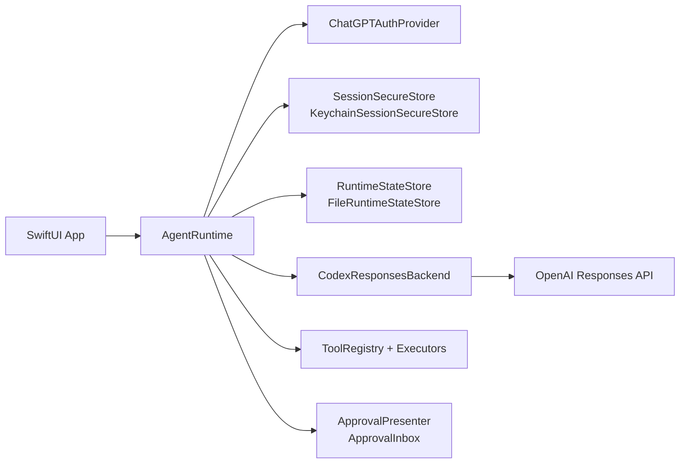

# CodexKit

[](https://github.com/timazed/CodexKit/actions/workflows/ci.yml)


`CodexKit` is a lightweight iOS-first SDK for embedding OpenAI Codex-style agents in Apple apps.

## Who This Is For

Use `CodexKit` if you are building a SwiftUI/iOS app and want:

- ChatGPT sign-in (device code or OAuth)
- secure session persistence
- resumable threaded conversations
- streamed assistant output
- host-defined tools with approval gates
- persona-aware agent behavior

The SDK stays tool-agnostic. Your app defines the tool surface and runtime UX.

## Quickstart (5 Minutes)

1. Add this package to your Xcode project.
2. Build an `AgentRuntime` with auth, secure storage, backend, approvals, and state store.
3. Sign in, create a thread, and send a message.

```swift
import CodexKit
import CodexKitUI

let approvalInbox = ApprovalInbox()
let deviceCodeCoordinator = DeviceCodePromptCoordinator()

let runtime = try AgentRuntime(configuration: .init(
    authProvider: try ChatGPTAuthProvider(
        method: .deviceCode,
        deviceCodePresenter: deviceCodeCoordinator
    ),
    secureStore: KeychainSessionSecureStore(
        service: "CodexKit.ChatGPTSession",
        account: "main"
    ),
    backend: CodexResponsesBackend(
        configuration: .init(
            model: "gpt-5.4",
            enableWebSearch: true
        )
    ),
    approvalPresenter: approvalInbox,
    stateStore: FileRuntimeStateStore(
        url: FileManager.default.urls(
            for: .applicationSupportDirectory,
            in: .userDomainMask
        ).first!
        .appendingPathComponent("CodexKit/runtime-state.json")
    )
))

let _ = try await runtime.signIn()
let thread = try await runtime.createThread(title: "First Chat")
let stream = try await runtime.sendMessage(
    UserMessageRequest(text: "Hello from iOS."),
    in: thread.id
)
```

## Feature Matrix

| Capability | Support |
| --- | --- |
| iOS auth: device code | Yes |
| iOS auth: browser OAuth (localhost callback) | Yes |
| Threaded runtime state + restore | Yes |
| Streamed assistant output | Yes |
| Host-defined tools + approval flow | Yes |
| Web search toggle (`enableWebSearch`) | Yes |
| Text + image input | Yes |
| Assistant image attachment rendering | Yes |
| Video/audio input attachments | Not yet |
| Built-in image generation API surface | Not yet (tool-based approach supported) |

## Package Products

- `CodexKit`: core runtime, auth, backend, tools, approvals
- `CodexKitUI`: optional SwiftUI-facing helpers

## Architecture



## Recommended Live Setup

The recommended production path for iOS is:

- `ChatGPTAuthProvider`
- `KeychainSessionSecureStore`
- `CodexResponsesBackend`
- `FileRuntimeStateStore`
- `ApprovalInbox` and `DeviceCodePromptCoordinator` from `CodexKitUI`

`ChatGPTAuthProvider` supports:

- `.deviceCode` for the most reliable sign-in path
- `.oauth` for browser-based ChatGPT OAuth

For browser OAuth, `CodexKit` uses the Codex-compatible redirect `http://localhost:1455/auth/callback` internally and only runs the loopback listener during active auth.

## Image Attachments

`CodexKit` supports:

- user text + image attachments
- image-only messages
- persisted image attachments in runtime state
- assistant image attachments returned by backend content

```swift
let imageData: Data = ...

let stream = try await runtime.sendMessage(
    UserMessageRequest(
        text: "Describe this image",
        images: [.jpeg(imageData)]
    ),
    in: thread.id
)
```

Custom tools can also return image URLs via `ToolResultContent.image(URL)`, and `CodexKit` attempts to hydrate those into assistant image attachments for chat rendering.

## Pinned And Dynamic Personas

`CodexKit` supports layered persona precedence:

- base runtime instructions
- thread-pinned persona
- turn override

Persona swaps are runtime metadata, not transcript messages, so they do not materially grow the transcript context.

```swift
let supportPersona = AgentPersonaStack(layers: [
    .init(name: "domain", instructions: "You are an expert customer support agent for a shipping app."),
    .init(name: "style", instructions: "Be concise, calm, and action-oriented.")
])

let thread = try await runtime.createThread(
    title: "Support Chat",
    personaStack: supportPersona
)

let reviewerOverride = AgentPersonaStack(layers: [
    .init(name: "reviewer", instructions: "For this reply only, act as a strict reviewer and call out risks first.")
])

let stream = try await runtime.sendMessage(
    UserMessageRequest(
        text: "Review this architecture and point out the risks.",
        personaOverride: reviewerOverride
    ),
    in: thread.id
)
```

## Demo App

The checked-in demo app under `DemoApp/` consumes local package products through SPM.


```sh
open DemoApp/AssistantRuntimeDemoApp.xcodeproj
```

The demo app exercises:

- device-code and browser-based ChatGPT sign-in
- streamed assistant output and resumable threads
- approval-gated host tools with a shipping quote example
- image messages from the photo library through the composer
- Responses web search in checked-in configuration
- thread-pinned personas and one-turn overrides
- a Health Coach tab with HealthKit steps, AI-generated coaching, local reminders, and tone switching

## Production Checklist

- Store sessions in keychain (`KeychainSessionSecureStore`)
- Use persistent runtime state (`FileRuntimeStateStore`)
- Gate impactful tools with approvals
- Handle auth cancellation and sign-out resets cleanly
- Add retry/backoff around network-dependent UX
- Log tool invocations and failures for supportability
- Validate HealthKit/notification permission fallback states if using health features

## Troubleshooting

- OAuth sheet closes but app does not update:
  - confirm redirect is `http://localhost:1455/auth/callback`
  - ensure app refreshes snapshot/state after sign-in completion
- Health steps stay at `0`:
  - verify HealthKit permission granted for Steps
  - confirm this is running on a device/profile with step data
- Tool never executes:
  - check approval prompt handling
  - inspect host logs for `toolCallStarted` / `toolCallFinished`

## Versioning And Releases

`CodexKit` uses Semantic Versioning. `v1.0.0` is the first stable release.

- Release notes live in [CHANGELOG.md](CHANGELOG.md)
- CI runs on pushes/PRs via [`.github/workflows/ci.yml`](.github/workflows/ci.yml)
- Stable releases are cut with annotated tags (`vMAJOR.MINOR.PATCH`)

## Contributing And Security

- Contributing guide: [CONTRIBUTING.md](CONTRIBUTING.md)
- Security policy: [SECURITY.md](SECURITY.md)
