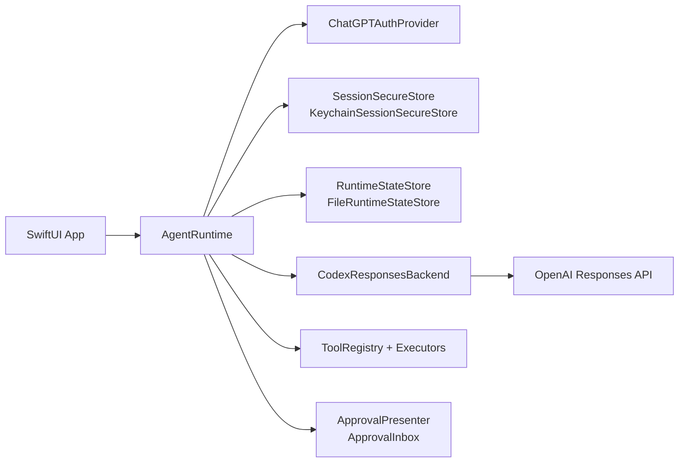

# CodexKit

[](https://github.com/timazed/CodexKit/actions/workflows/ci.yml)


`CodexKit` is a lightweight iOS-first SDK for embedding OpenAI Codex-style agents in Apple apps.

## Who This Is For

Use `CodexKit` if you are building a SwiftUI/iOS app and want:

- ChatGPT sign-in (device code or OAuth)
- secure session persistence
- resumable threaded conversations
- streamed assistant output
- typed one-shot text and structured completions
- host-defined tools with approval gates
- persona- and skill-aware agent behavior
- share/import-friendly message construction

The SDK stays tool-agnostic. Your app defines the tool surface and runtime UX.

## Quickstart (5 Minutes)

1. Add this package to your Xcode project.
2. Build an `AgentRuntime` with auth, secure storage, backend, approvals, and state store.
3. Sign in, create a thread, and send a message.

```swift
import CodexKit
import CodexKitUI

let approvalInbox = ApprovalInbox()
let deviceCodeCoordinator = DeviceCodePromptCoordinator()

let runtime = try AgentRuntime(configuration: .init(
    authProvider: try ChatGPTAuthProvider(
        method: .deviceCode,
        deviceCodePresenter: deviceCodeCoordinator
    ),
    secureStore: KeychainSessionSecureStore(
        service: "CodexKit.ChatGPTSession",
        account: "main"
    ),
    backend: CodexResponsesBackend(
        configuration: .init(
            model: "gpt-5.4",
            reasoningEffort: .medium,
            enableWebSearch: true
        )
    ),
    approvalPresenter: approvalInbox,
    stateStore: FileRuntimeStateStore(
        url: FileManager.default.urls(
            for: .applicationSupportDirectory,
            in: .userDomainMask
        ).first!
        .appendingPathComponent("CodexKit/runtime-state.json")
    )
))

let _ = try await runtime.signIn()
let thread = try await runtime.createThread(title: "First Chat")
let stream = try await runtime.streamMessage(
    UserMessageRequest(text: "Hello from iOS."),
    in: thread.id
)
```

## Feature Matrix

| Capability | Support |
| --- | --- |
| iOS auth: device code | Yes |
| iOS auth: browser OAuth (localhost callback) | Yes |
| Threaded runtime state + restore | Yes |
| Streamed assistant output | Yes |
| Host-defined tools + approval flow | Yes |
| Configurable thinking level | Yes |
| Web search toggle (`enableWebSearch`) | Yes |
| Built-in request retry/backoff | Yes (configurable) |
| Text + image input | Yes |
| Typed structured output (`Decodable`) | Yes |
| Share/import helper (`AgentImportedContent`) | Yes |
| App Intents / Shortcuts example | Yes |
| Assistant image attachment rendering | Yes |
| Video/audio input attachments | Not yet |
| Built-in image generation API surface | Not yet (tool-based approach supported) |

## Package Products

- `CodexKit`: core runtime, auth, backend, tools, approvals
- `CodexKitUI`: optional SwiftUI-facing helpers

## Architecture



## Recommended Live Setup

The recommended production path for iOS is:

- `ChatGPTAuthProvider`
- `KeychainSessionSecureStore`
- `CodexResponsesBackend`
- `FileRuntimeStateStore`
- `ApprovalInbox` and `DeviceCodePromptCoordinator` from `CodexKitUI`

`ChatGPTAuthProvider` supports:

- `.deviceCode` for the most reliable sign-in path
- `.oauth` for browser-based ChatGPT OAuth

For browser OAuth, `CodexKit` uses the Codex-compatible redirect `http://localhost:1455/auth/callback` internally and only runs the loopback listener during active auth.

`CodexResponsesBackend` also includes built-in retry/backoff for transient failures (`429`, `5xx`, and network-transient URL errors like `networkConnectionLost`). You can tune or disable it:

```swift
let backend = CodexResponsesBackend(
    configuration: .init(
        model: "gpt-5.4",
        requestRetryPolicy: .init(
            maxAttempts: 3,
            initialBackoff: 0.5,
            maxBackoff: 4,
            jitterFactor: 0.2
        )
        // or disable:
        // requestRetryPolicy: .disabled
    )
)
```

`CodexResponsesBackendConfiguration` also lets you control the model thinking level:

```swift
let backend = CodexResponsesBackend(
    configuration: .init(
        model: "gpt-5.4",
        reasoningEffort: .high
    )
)
```

Available values:

- `.low`
- `.medium`
- `.high`
- `.extraHigh`

## Typed Completions

For App Intents, share flows, widgets, or other non-chat surfaces, `CodexKit` can return a typed value directly from `sendMessage`:

```swift
let summary = try await runtime.sendMessage(
    UserMessageRequest(text: "Summarize the latest thread activity."),
    in: thread.id
)
```

Structured output is schema-driven and decoded into your `Decodable` type:

```swift
struct ShippingReplyDraft: AgentStructuredOutput {
    let subject: String
    let reply: String
    let urgency: String

    static let responseFormat = AgentStructuredOutputFormat(
        name: "shipping_reply_draft",
        description: "A concise shipping support reply draft.",
        schema: .object(
            properties: [
                "subject": .string(),
                "reply": .string(),
                "urgency": .string(enum: ["low", "medium", "high"]),
            ],
            required: ["subject", "reply", "urgency"],
            additionalProperties: false
        )
    )
}

let draft = try await runtime.sendMessage(
    UserMessageRequest(text: "Draft a response for the delayed package."),
    in: thread.id,
    expecting: ShippingReplyDraft.self
)
```

`CodexKit` sends that through the OpenAI Responses structured-output path and stores the assistant's final JSON reply in thread history like any other assistant turn.

If you need something more specialized, `AgentStructuredOutputFormat` still supports a raw-schema escape hatch via `rawSchema: JSONValue`.

## Image Attachments

`CodexKit` supports:

- user text + image attachments
- image-only messages
- persisted image attachments in runtime state
- assistant image attachments returned by backend content

```swift
let imageData: Data = ...

let stream = try await runtime.streamMessage(
    UserMessageRequest(
        text: "Describe this image",
        images: [.jpeg(imageData)]
    ),
    in: thread.id
)
```

Custom tools can also return image URLs via `ToolResultContent.image(URL)`, and `CodexKit` attempts to hydrate those into assistant image attachments for chat rendering.

## Pinned And Dynamic Personas

`CodexKit` supports layered persona precedence:

- base runtime instructions
- thread-pinned persona
- turn override

Persona swaps are runtime metadata, not transcript messages, so they do not materially grow the transcript context.

```swift
let supportPersona = AgentPersonaStack(layers: [
    .init(name: "domain", instructions: "You are an expert customer support agent for a shipping app."),
    .init(name: "style", instructions: "Be concise, calm, and action-oriented.")
])

let thread = try await runtime.createThread(
    title: "Support Chat",
    personaStack: supportPersona
)

let reviewerOverride = AgentPersonaStack(layers: [
    .init(name: "reviewer", instructions: "For this reply only, act as a strict reviewer and call out risks first.")
])

let stream = try await runtime.streamMessage(
    UserMessageRequest(
        text: "Review this architecture and point out the risks.",
        personaOverride: reviewerOverride
    ),
    in: thread.id
)
```

## Share Extensions And Imported Content

Share extensions stay app-owned, but `CodexKit` now includes `AgentImportedContent` to normalize the content you extract from a share sheet before sending it into the runtime.

```swift
let imported = AgentImportedContent(
    textSnippets: [sharedExcerpt],
    urls: [sharedURL],
    images: sharedImages
)

let request = UserMessageRequest(
    prompt: "Summarize this shared content and call out the next action.",
    importedContent: imported
)

let summary = try await runtime.sendMessage(
    request,
    in: thread.id
)
```

That keeps the SDK focused on runtime capability while letting your app own the actual `Share Extension`, `NSItemProvider`, and presentation flow.

## App Intents And Shortcuts

App Intents also stay app-owned, but the demo app now includes working source examples for:

- summarizing imported text/links through `AgentImportedContent`
- generating a typed shipping support draft through `sendMessage(..., expecting:)`

The source lives in:

- [`DemoAppShortcuts.swift`](/Users/tima/Projects/AssistantAI/CodexKit/DemoApp/AssistantRuntimeDemoApp/Shared/DemoAppShortcuts.swift)

A minimal App Intent shape looks like this:

```swift
struct SummarizeImportedContentIntent: AppIntent {
    static let title: LocalizedStringResource = "Summarize Imported Content"
    static let openAppWhenRun = false

    @Parameter(title: "Text")
    var text: String

    @Parameter(title: "Link")
    var link: URL?

    @MainActor
    func perform() async throws -> some IntentResult & ProvidesDialog {
        let runtime = AgentDemoRuntimeFactory.makeRestorableRuntimeForSystemIntegration()
        _ = try await runtime.restore()

        guard await runtime.currentSession() != nil else {
            return .result(dialog: "Sign in to the app first.")
        }

        let thread = try await runtime.createThread(title: "Shortcut Summary")
        let request = UserMessageRequest(
            prompt: "Summarize this imported content in three short bullet points.",
            importedContent: .init(
                textSnippets: [text],
                urls: link.map { [$0] } ?? []
            )
        )

        let summary = try await runtime.sendMessage(
            request,
            in: thread.id
        )
        return .result(dialog: IntentDialog(stringLiteral: summary))
    }
}
```

## Demo App

The checked-in demo app under `DemoApp/` consumes local package products through SPM.


```sh
open DemoApp/AssistantRuntimeDemoApp.xcodeproj
```

The demo app exercises:

- device-code and browser-based ChatGPT sign-in
- on-screen structured output demos for typed shipping drafts and imported-content summaries
- streamed assistant output and resumable threads
- App Intents / Shortcuts examples in source
- host tools with skill-specific examples for health coaching and travel planning
- image messages from the photo library through the composer
- Responses web search in checked-in configuration
- thread-pinned personas and one-turn overrides
- a one-tap skill policy probe that compares tool behavior in normal vs skill-constrained threads
- a Health Coach tab with HealthKit steps, AI-generated coaching, local reminders, and tone switching

## Skill Examples

`CodexKit` skills are behavior modules, not just tone layers. They can carry both instructions and execution policy (tool allow/require/sequence/call limits).

```swift
let healthCoachSkill = AgentSkill(
    id: "health_coach",
    name: "Health Coach",
    instructions: "You are a health coach focused on daily step goals and execution. For every user turn, call the health_coach_fetch_progress tool exactly once before your final reply.",
    executionPolicy: .init(
        allowedToolNames: ["health_coach_fetch_progress"],
        requiredToolNames: ["health_coach_fetch_progress"],
        maxToolCalls: 1
    )
)

let travelPlannerSkill = AgentSkill(
    id: "travel_planner",
    name: "Travel Planner",
    instructions: "You are a travel planning assistant for mobile users. Provide concise day-by-day itineraries, practical logistics, and a compact packing checklist.",
    executionPolicy: .init(
        allowedToolNames: ["lookup_flights", "lookup_hotels"],
        requiredToolNames: ["lookup_flights"],
        toolSequence: ["lookup_flights", "lookup_hotels"],
        maxToolCalls: 3
    )
)

let runtime = try AgentRuntime(configuration: .init(
    authProvider: authProvider,
    secureStore: secureStore,
    backend: backend,
    approvalPresenter: approvalPresenter,
    stateStore: stateStore,
    skills: [healthCoachSkill, travelPlannerSkill]
))

let healthThread = try await runtime.createThread(
    title: "Skill Demo: Health Coach",
    skillIDs: ["health_coach"]
)

let tripThread = try await runtime.createThread(
    title: "Skill Demo: Travel Planner",
    skillIDs: ["travel_planner"]
)

let stream = try await runtime.streamMessage(
    UserMessageRequest(
        text: "Review this plan with extra travel rigor.",
        skillOverrideIDs: ["travel_planner"]
    ),
    in: healthThread.id
)
```

## Dynamic Persona And Skill Sources

You can load persona/skill instructions from local files or remote URLs at runtime.

```swift
let localPersonaURL = URL(fileURLWithPath: "/path/to/persona.txt")
let thread = try await runtime.createThread(
    title: "Dynamic Persona Thread",
    personaSource: .file(localPersonaURL)
)
```

```swift
let remoteSkillURL = URL(string: "https://example.com/skills/shipping_support.json")!
let skill = try await runtime.registerSkill(
    from: .remote(remoteSkillURL)
)

try await runtime.setSkillIDs([skill.id], for: thread.id)
```

For persona sources:

- plain text creates a single-layer persona stack
- JSON can be a full `AgentPersonaStack`

For skill sources:

- JSON supports `{ "id": "...", "name": "...", "instructions": "...", "executionPolicy": { ... } }`
- plain text is supported when you pass `id` and `name` in `registerSkill(from:id:name:)`

## Debugging Instruction Resolution

You can preview the exact compiled instructions for a specific send before starting a turn.

```swift
let preview = try await runtime.resolvedInstructionsPreview(
    for: thread.id,
    request: UserMessageRequest(
        text: "Give me a strict step plan."
    )
)
print(preview)
```

## Production Checklist

- Store sessions in keychain (`KeychainSessionSecureStore`)
- Use persistent runtime state (`FileRuntimeStateStore`)
- Gate impactful tools with approvals
- Handle auth cancellation and sign-out resets cleanly
- Tune retry/backoff policy for your app’s UX and latency targets
- Log tool invocations and failures for supportability
- Validate HealthKit/notification permission fallback states if using health features

## Troubleshooting

- OAuth sheet closes but app does not update:
  - confirm redirect is `http://localhost:1455/auth/callback`
  - ensure app refreshes snapshot/state after sign-in completion
- Health steps stay at `0`:
  - verify HealthKit permission granted for Steps
  - confirm this is running on a device/profile with step data
- Tool never executes:
  - check approval prompt handling
  - inspect host logs for `toolCallStarted` / `toolCallFinished`

## Versioning And Releases

`CodexKit` uses Semantic Versioning. The latest stable release is `v1.1.0`, and the current prerelease target is `v2.0.0-alpha.1`.

- Release notes live in [CHANGELOG.md](CHANGELOG.md)
- CI runs on pushes/PRs via [`.github/workflows/ci.yml`](.github/workflows/ci.yml)
- Pushing a `v*` tag creates a GitHub Release automatically via [`.github/workflows/release.yml`](.github/workflows/release.yml)
- Tags containing a hyphen, such as `v2.0.0-alpha.1`, are published as GitHub prereleases automatically
- The release workflow also supports manual dispatch for an existing tag if you need to publish a release page after the tag already exists
- Stable releases are cut with annotated tags (`vMAJOR.MINOR.PATCH`)

## Contributing And Security

- Contributing guide: [CONTRIBUTING.md](CONTRIBUTING.md)
- Security policy: [SECURITY.md](SECURITY.md)
