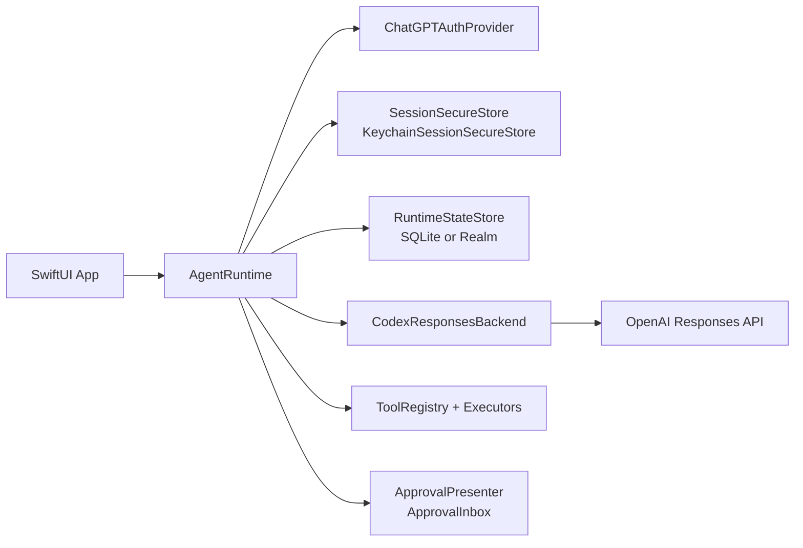

# CodexKit documentation

[Back to the README](../README.md)

Start with the [quickstart](../README.md#quickstart), then choose a guide for the capability you are integrating. These guides describe the 2.0 development line on `main`.

## Guides

| Guide | Topics |
| --- | --- |
| [Backend configuration and models](backend-configuration.md) | Account auth, retries, response budgets, GPT-6 Astra, reasoning, response state |
| [Local Codex login on macOS](auth-on-macos.md) | Read-only discovery, external ownership, renewal, and disconnect |
| [Runtime progress, tools, and turn control](upstream-runtime-features.md) | Parallel tools, progress, model discovery, usage limits, steering, interruption |
| [Messaging and images](messaging.md) | Event buffering, execution limits, typed context, structured replies, images |
| [SDK integration](sdk-integration.md) | Host-managed sessions, execution handles, async observation, typed HTTP errors |
| [Persistence and observation](persistence.md) | SQLite/Realm integration, migration, queries, Combine, context compaction |
| [Memory](memory.md) | Capture, retrieval, guided writing, raw stores, attribution |
| [Personas and skills](personas-and-skills.md) | Layered instructions, tool policies, dynamic definitions, previews |
| [Apple app integrations](apple-integrations.md) | Background completion, share extensions, App Intents, Shortcuts |
| [Logging and troubleshooting](logging-and-troubleshooting.md) | Diagnostics, production checks, common failures |
| [Migration and releases](migration.md) | Changes between alpha versions and release conventions |
| [Verification](verification.md) | CI simulator execution, opt-in live tests, performance checks |
| [Release readiness](release-readiness-2026-09-10.md) | Alpha.28 candidate verification and publication status |
| [Workload measurements](performance-2026-09-08.md) | Images, database paging, cancellation, optimized pipeline |
| [Demo app](../DemoApp/README.md) | Setup and a walkthrough of the runtime features |

## Core Concepts

- `AgentRuntime`
  The main entry point. Owns auth state, threads, turn control, tool execution, personas, skills, and optional memory.
- `AgentThread`
  A persistent conversation with its own status, title, persona stack, skill IDs, and optional memory context.
- `Request`
  A single turn request. Can include text, images, imported content, optional app-provided context, optional fulfillment-policy options, persona override, skill override, and memory selection.
- `RequestOptionsRepresentable`
  A typed, app-owned way to describe fulfillment policy for a turn through a mode plus natural-language requirements.
- `CodexResponsesBackend`
  The built-in ChatGPT/Codex-style backend used for text/image/tool turns.
- `ToolDefinition`
  A host-defined capability the model can call through your app.
- `AgentPersonaStack`
  Layered behavior instructions pinned to a thread or applied for one turn.
- `AgentSkill`
  A behavior module that can carry instructions plus tool policy.
- `AgentStructuredOutput`
  A typed `Decodable` contract for schema-constrained replies.
- `AgentMemoryConfiguration`
  Optional local memory storage, retrieval, ranking, and capture policy.

## Choose Your Level

- Simple chat
  Sign in, create a thread, and call `stream(...)` or `send(...)`.
- Typed app flows
  Use `send(..., response:)` to get a `Decodable` value back.
- Guided retrieval/enrichment
  Use `Request.options` to tell the model how to fulfill the turn so the typed response contract can be satisfied.
- Tool-driven agents
  Register host tools, optionally gate them with approvals, and opt independent tools into bounded parallel execution.
- Rich behavior
  Add thread personas, skills, and execution policies.
- Memory-backed agents
  Opt into automatic memory capture, guided writing, or raw record management.

## Feature Matrix

| Capability | Support |
| --- | --- |
| Supported platforms | iOS 17+, macOS 14+ |
| iOS auth: device code | Yes |
| iOS auth: browser OAuth (localhost callback) | Yes |
| macOS auth: browser OAuth and device code | Yes |
| macOS auth: reuse a local Codex session | Read-only file/direct Keychain discovery with explicit effective settings; renewal depends on the owner |
| Threaded runtime state + restore | Yes |
| Streamed assistant output | Yes |
| Host-defined tools + approval flow | Yes |
| Independent parallel tools | Opt-in, bounded concurrency |
| Reasoning summaries, search progress, message phases | Yes, when supplied by the model |
| Account model discovery + usage-limit snapshots | Yes |
| Add input to an active turn + interrupt | Yes |
| Per-thread model + thinking level | Yes |
| Web search toggle (`enableWebSearch`) | Yes |
| Built-in request retry/backoff | Yes (configurable) |
| Structured local memory layer | Yes |
| Text + image input | Yes |
| Typed request context | Yes |
| Declarative request fulfillment policy | Yes |
| Typed structured output (`Decodable`) | Yes |
| Mixed streamed text + typed structured output | Yes |
| Share/import helper (`AgentImportedContent`) | Yes |
| App Intents / Shortcuts example | Yes |
| Assistant image attachment rendering | Yes |
| Hosted image generation (`enableImageGeneration`) | Yes |
| Video/audio input attachments | Not yet |

## Architecture

## Design notes

- [Runtime architecture](runtime-architecture.md)
- [Runtime performance verification](performance-2026-09-07.md)
- [Follow-up codebase audit and fixes](followup-audit-2026-09-07.md)
- [Deeper audit and remaining edge cases](deep-audit-2026-09-07.md)
- [Test, live-provider, and device verification](verification.md)
- [ChatGPT authentication on iOS](auth-on-ios.md)
- [Upstream extraction audit](extraction-audit.md)
